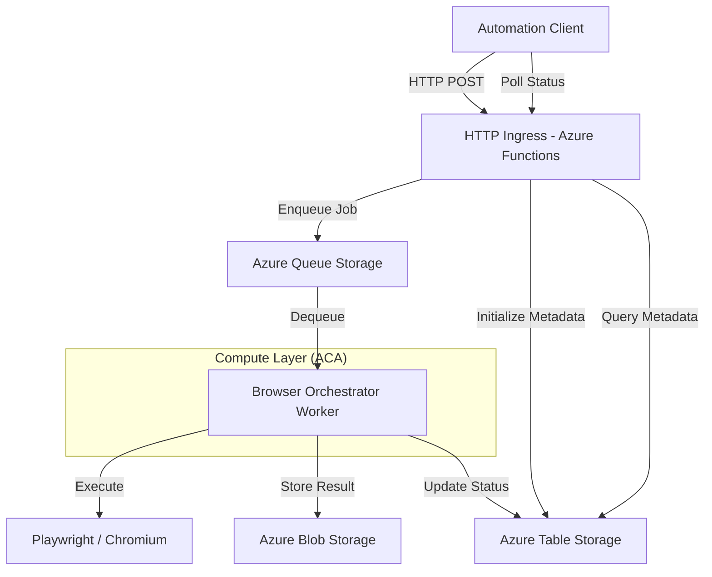

# Capture Automation Platform

A high-scale, cloud-native browserless web capture service designed for complex automation workflows. This platform provides a robust foundation for capturing, processing, and extracting intelligent data from the web using containerized Playwright instances.

## Overview

The Capture Automation Platform is built to handle the "thundering herd" problem and resource-intensive nature of headless browser clusters. It leverages an **Asynchronous Request-Reply** pattern with queue-based load leveling to ensure reliability and scalability, making it ideal for large-scale data extraction and archival tasks.

### Key Architectural Pillars

* **Asynchronous Request-Reply Pattern:** Decouples request ingestion from intensive processing, providing immediate acknowledgment while background workers handle the capture.
* **Queue-Based Load Leveling:** Utilizes Azure Queue Storage to buffer spikes in traffic, protecting downstream resources and ensuring consistent performance.
* **Containerized Playwright Environment:** Ensures identical execution environments for browser automation, eliminating client-side rendering inconsistencies and providing a stable platform for complex document rendering.
* **Scale-to-Zero Compute:** Designed for deployment on Azure Container Apps (ACA), allowing the browser orchestrator to scale dynamically based on queue depth, including scaling to zero to minimize idle costs.
* **Intelligent Markdown Extraction:** Integrates Mozilla's Readability library to extract clean, structured markdown from complex web pages, optimized for LLM consumption and archival.

---

## 🏗️ Architecture

The platform follows a microservices-inspired architecture managed within a TypeScript monorepo.



## 📂 Project Structure

```text
/capture-automation-platform
├── .github/workflows/         # CI/CD: QA and deployment pipelines (planned)
├── infrastructure/            # IaC (Azure Resources)
│   ├── acr.bicep              # Azure Container Registry deployment
│   └── README.md              # Infrastructure documentation
├── packages/                  # Shared Logic/Types
│   └── shared-types/          # Shared job and status interfaces
├── services/                  # Backend Microservices
│   └── api-gateway/           # HTTP Ingress (AFA)
│   └── browser-orchestrator/  # Playwright-based capture service (ACA)
└── web/                       # UI for manual job submission
```

---

## 🛠️ Tech Stack

* **Language:** TypeScript (Node.js 20+)
* **Browser Automation:** Playwright (Chromium)
* **Cloud Provider:** Microsoft Azure
  * **Compute:** Azure Container Apps (Worker), Azure Functions (Ingress - *WIP*)
  * **Storage:** Azure Blob Storage (Output), Azure Queue Storage (Jobs), Azure Table Storage (Metadata)
* **DevOps:** Docker, Azure Bicep, GitHub Actions

---

## 🚦 Current Status & Roadmap

The project is currently in active development. The core processing engine is functional, and the platform is being prepared for its first full cloud deployment.

- [X] **Shared Type System**: Unified contracts for job orchestration.
- [X] **Core Worker Engine**: Playwright orchestration and Azure Storage adapters.
- [X] **Containerization**: Optimized Docker image with Playwright dependencies.
- [ ] **HTTP Ingress (AFA)**: Azure Functions-based entry point for job submission and status polling.
- [ ] **Infrastructure-as-Code**: Complete Bicep templates for ACA/AFA/Storage deployment.
- [ ] **Web UI**: A modern dashboard for manual job submission and visual result inspection.

---

## 💻 Getting Started (Local Development)

The platform is designed to be easily testable locally using Azurite for Azure Storage emulation.

### Prerequisites

- **Node.js**: v20+
- **Azurite**: Required for local storage/queue emulation.
  - Recommended: `npm run services:up --workspace @capture-automation-platform/browser-orchestrator`
  - Manual: `docker run -p 10000:10000 -p 10001:10001 -p 10002:10002 mcr.microsoft.com/azure-storage/azurite --skipApiVersionCheck`
- **Playwright Browsers**: `npx playwright install chromium`

### Installation

Due to a temporary peer dependency conflict with TypeScript 6.0 and `@typescript-eslint`, you **must** use the legacy peer deps flag:

```bash
npm install --legacy-peer-deps
```

### Initial Build

Always build the shared types first, as all other services depend on them:

```bash
# Build everything
npm run build
```

## 🏃 Running the System

The project uses a unified **Azurite-backed** workflow:

1. **Start Azurite**:
   ```bash
   npm run services:up --workspace @capture-automation-platform/browser-orchestrator
   ```
2. **Start Worker**:
   ```bash
   npm run dev --workspace @capture-automation-platform/browser-orchestrator
   ```
3. **Submit Jobs (CLI)**:
   ```bash
   npm run ingress --workspace @capture-automation-platform/browser-orchestrator -- <url> [type]
   ```

   Example: `npm run ingress --workspace @capture-automation-platform/browser-orchestrator -- https://example.com pdf`