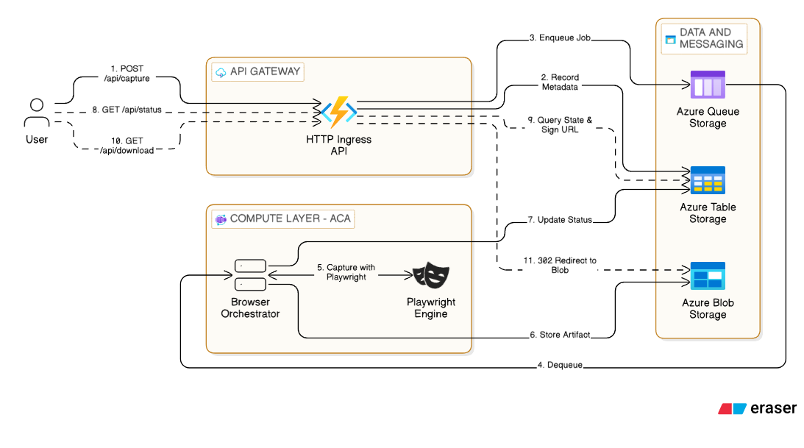

# Capture Automation Platform

A high-scale, cloud-native browserless web capture service designed for complex automation workflows. This platform provides a robust foundation for capturing, processing, and extracting intelligent data from the web using containerized Playwright instances.

## Overview

The Capture Automation Platform is built to handle the "thundering herd" problem and resource-intensive nature of headless browser clusters. It leverages an **Asynchronous Request-Reply** pattern with queue-based load leveling to ensure reliability and scalability, making it ideal for large-scale data extraction and archival tasks.

### Key Architectural Pillars

* **Asynchronous Request-Reply Pattern:** Decouples request ingestion from intensive processing, providing immediate acknowledgment while background workers handle the capture.
* **Queue-Based Load Leveling:** Utilizes Azure Queue Storage to buffer spikes in traffic, protecting downstream resources and ensuring consistent performance.
* **Containerized Playwright Environment:** Ensures identical execution environments for browser automation, eliminating client-side rendering inconsistencies and providing a stable platform for complex document rendering.
* **Scale-to-Zero Compute:** Designed for deployment on Azure Container Apps (ACA), allowing the browser orchestrator to scale dynamically based on queue depth, including scaling to zero to minimize idle costs.
* **Intelligent Markdown Extraction:** Integrates Mozilla's Readability library to extract clean, structured markdown from complex web pages, optimized for LLM consumption and archival.

---

### 🏗️ System Architecture

[Click here to view full resolution](https://github.com/farhatraiyan/capture-automation-platform/blob/main/docs/architecture.png)

<picture>
  <source media="(prefers-color-scheme: dark)" srcset="docs/architecture-dark.png">
  <source media="(prefers-color-scheme: light)" srcset="docs/architecture-light.png">
  
</picture>

## 📂 Project Structure

```text
/capture-automation-platform
├── .github/workflows/         # CI/CD: QA pipelines
├── infrastructure/            # IaC (Azure Bicep modules + deploy docs)
│   ├── identity.bicep         # User-Assigned Managed Identity
│   ├── storage.bicep          # Storage Account + container/queue/table + data-plane roles
│   ├── registry.bicep         # Azure Container Registry + AcrPull role
│   ├── functions.bicep        # Flex Consumption Function App (ingress-api shell)
│   ├── containerapp.bicep     # ACA Environment + Container App (browser-orchestrator)
│   └── README.md              # Deployment commands, verification, teardown
├── packages/                  # Shared Logic/Types
│   ├── azure-adapters/        # Shared Azure infrastructure logic
│   └── shared-types/          # Shared job and status interfaces
├── scripts/                   # Dev + deployment tooling
│   ├── setup-azurite.ts       # Bootstrap local Azurite container/queue/table
│   └── stage-ingress-api.sh   # Bundle ingress-api
├── services/                  # Backend Microservices
│   ├── browser-orchestrator/  # Playwright-based capture service (ACA)
│   └── ingress-api/           # HTTP Ingress (AFA)
└── web/                       # UI for manual job submission (planned)
```

---

## 🛠️ Tech Stack

* **Language:** TypeScript (Node.js 20+)
* **Browser Automation:** Playwright (Chromium)
* **Cloud Provider:** Microsoft Azure
  * **Compute:** Azure Container Apps (Worker), Azure Functions (Ingress)
  * **Storage:** Azure Blob Storage (Output), Azure Queue Storage (Jobs), Azure Table Storage (Metadata)
* **DevOps:** Docker, Azure Bicep, GitHub Actions

---

## 🚦 Current Status & Roadmap

The core processing engine is functional and the platform has been deployed end-to-end to Azure with a working capture pipeline.

- [X] **Shared Type System**: Unified contracts for job orchestration.
- [X] **Core Worker Engine**: Playwright orchestration and Azure Storage adapters.
- [X] **Containerization**: Optimized Docker image with Playwright dependencies.
- [X] **HTTP Ingress (AFA)**: Azure Functions-based entry point for job submission and status polling.
- [X] **Infrastructure-as-Code**: Bicep modules for identity, storage, ACR, Functions (Flex Consumption), and Container Apps.
- [X] **Adapter migration to `DefaultAzureCredential`**: deployed posture is identity-only; local + CI keep the connection-string path via `fromConnectionString` factories. Flipping `allowSharedKeyAccess: false` is gated on a follow-up `AzureWebJobsStorage` migration.
- [ ] **Web UI**: A modern dashboard for manual job submission and visual result inspection.

---

## 💻 Getting Started (Local Development)

The platform is designed to be easily testable locally using Azurite for Azure Storage emulation.

### Prerequisites

- **Node.js**: v20+
- **Docker**: Required for Azurite storage emulation and containerized worker testing.
- **Playwright Browsers**: `npx playwright install chromium`

### Installation

Due to a temporary peer dependency conflict with TypeScript 6.0 and `@typescript-eslint`, you **must** use the legacy peer deps flag:

```bash
npm install --legacy-peer-deps
```

### Initial Build

Always build the shared types first, as all other services depend on them:

```bash
# Build everything
npm run build
```

## 🏃 Running the Platform

The platform is designed to be easily testable locally using Azurite for Azure Storage emulation and **PM2** for background process management.

### 1. Start Infrastructure (Azurite)
Starts Azurite (via Docker), waits for ports, and automatically initializes the required containers, queues, and tables.

```bash
npm run azurite:up
```

### 2. Start Background Services
Launches the Ingress API and the Browser Orchestrator worker in the background using PM2. Requires Azurite to be running.

```bash
npm run start
```

### 3. Submit Jobs (CLI)
While the platform is running, submit jobs using the dev CLI:

```bash
npm run ingress --workspace @capture-automation-platform/browser-orchestrator -- <url> [type]
```

Example: `npm run ingress --workspace @capture-automation-platform/browser-orchestrator -- https://example.com pdf`

### 4. Monitor & Logs
Since services run in the background, use PM2 to monitor them:

```bash
# View status of all services
npx pm2 status

# Tail logs for all services
npx pm2 logs

# Stop all background services
npm run teardown
```

## ☁️ Cloud Deployment

To deploy the platform to your own Azure subscription, see [`infrastructure/README.md`](infrastructure/README.md). It covers:

- Prerequisites (Azure CLI, Docker, `func` CLI, Azure resource provider registration, Flex Consumption region availability)
- Each Bicep module: what it provisions, how to deploy it, how to verify
- Application deployment: building and pushing the browser-orchestrator image; staging and publishing the ingress-api
- Teardown: `az group delete` returns to a clean slate (everything is RG-scoped)

## 🧪 Testing

The platform uses a decoupled testing strategy where tests run directly against source files using `tsx`.

### 1. Workspace Tests
Run isolated unit and integration tests for a specific workspace:

```bash
# Run tests for a workspace
npm test --workspace @capture-automation-platform/azure-adapters
```

### 2. Platform Integration Tests
Runs the full end-to-end integration suite across all services:

```bash
npm run test:platform
```